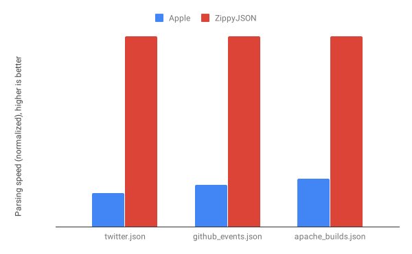

# ZippyJSON
## A much faster version of JSONDecoder

[](https://cocoapods.com)
[](https://swift.org/package-manager/)

## Benchmarks



These benchmarks were done on a Macbook Pro. The results are very similar on the iPhone (ZippyJSON is 3x+ faster for all 3 files on both platforms).

## Usage

Just replace `JSONDecoder` with `ZippyJSONDecoder` wherever you want to use it. So instead of `let decoder = JSONDecoder()`, do `let decoder = ZippyJSONDecoder()`, and everything will just work. This is because `ZippyJSONDecoder` has the exact same API as `JSONDecoder` (i.e. it's drop-in). Also, don't forget to add `import ZippyJSON` in files where you use it.

## Why is it so much faster?

- Apple's version first converts the JSON into an `NSDictionary` using `NSJSONSerialization` and then afterwards makes things Swifty. The creation of that intermediate dictionary is expensive.
- ZippyJSON is built largely in C++ (but still with a Swift interface wrapped around it). For the initial parsing (you might call it tokenizing), it uses [simdjson](https://github.com/lemire/simdjson), a very fast library that makes good use of vectorization. Apple, on the other hand, uses entirely [Swift](https://github.com/apple/swift/blob/master/stdlib/public/Darwin/Foundation/JSONEncoder.swift) (aside from the use of `NSJSONSerialization`) which is generally slower.
- There are many specific optimizations in there as well. For example, date parsing for ISO-8601 dates is 10x faster due to using JJLISO8601DateFormatter instead of Apple's date formatter.

So, it's largely due to Apple trying to be elegant and operate at a higher level.

## When should you use this library?

At first, default to using `JSONDecoder`. It's very battle-tested, and for plenty of use cases is just fine. Then, once you start looking for new things to optimize, take a look at how long your JSON parsing is taking. After all, JSON parsing can be a bottleneck for getting data to the user. As a rule of thumb, divide its current time taken by 4 to approximate the time taken with ZippyJSON. If that difference is significant to you (and even milliseconds can impact a user experience!), then consider using ZippyJSON.

## Future improvements

There are still many places in the code that are ripe for optimization. Feel free to submit a ticket if you have a specific case where you need more performant JSON parsing, and where ZippyJSON is not already 4x faster than Apple's. JSONEncoder and NSJSONSerialization are also promising for optimzation, please chime in if you need one of these improved.

## Installation

### Cocoapods

ZippyJSON is available through [CocoaPods](https://cocoapods.org) (SPM support is in the works). To install
it, simply add the following line to your Podfile:

```ruby
pod 'ZippyJSON'
```

You can also make it `pod 'ZippyJSON', :inhibit_warnings => true` if you want to suppress all warnings.

### SwiftPM (iOS only)

Add the package in the SwiftPM packages area with repository URL https://github.com/michaeleisel/ZippyJSON

## Author

Michael Eisel, michael.eisel@gmail.com
